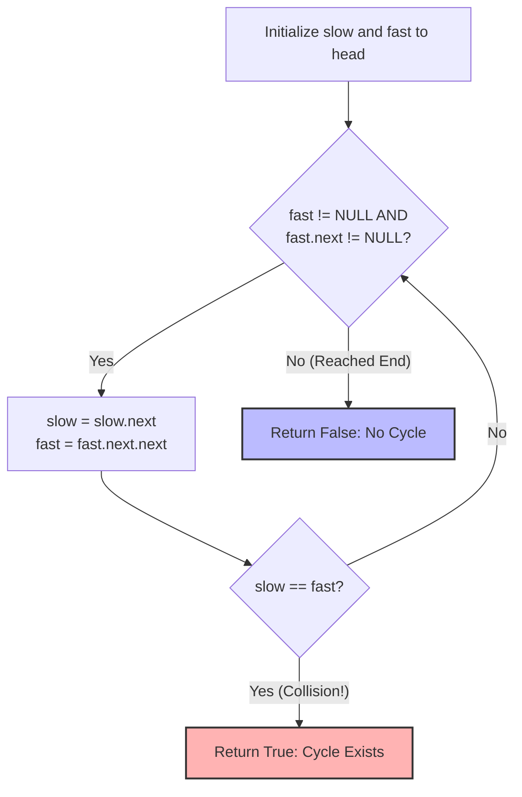

# Linked List Cycle - Senior Engineer Interview Prep Guide

This guide contrasts space-consuming state-tracking sets against the classic hardware/pointer optimization known as Floyd's Cycle Detection Algorithm (Tortoise and Hare).

---

## 1. Algorithmic Approaches & Comparisons

Detecting a cycle is a fundamental problem in graph theory and list navigation. Without safety mechanisms, traversing a cyclic list will result in an infinite loop and crash the application.

### Approach 1: Hash Set (State Tracking)
Traverse the linked list normally. As we visit each node, we check if it already exists in a `Visited` Hash Set. If yes, we've found a cycle! If not, we add its memory reference (not just the value, because values can repeat) to the set.
- **Time Complexity:** $O(n)$ - We visit each node at most once. Hash set lookups are $O(1)$.
- **Space Complexity:** $O(n)$ - We store $n$ node references in the worst-case scenario (no cycle, or cycle at the very end).
- **When to use:** Good starter approach. It works universally for all generic graphs and graphs with multiple incoming edges, but fails the strict $O(1)$ follow-up constraint.

### Approach 2: Floyd's Tortoise and Hare (Optimal Constant Space)
Use two pointers moving down the list at different speeds. The "Tortoise" moves 1 step at a time, while the "Hare" moves 2 steps. 
- If the list has no cycle, the Hare will rapidly reach the end (`NULL`) and we safely return `false`.
- If there *is* a cycle, the Hare will loop around and eventually "lap" the Tortoise from behind. The moment both pointers point to the exact same node memory address, we have mathematically proven a cycle exists.
- **Time Complexity:** $O(n)$ - In the worst case, the Hare runs around the cycle but always catches the Tortoise within $O(n)$ iterations.
- **Space Complexity:** $O(1)$ - Only using two pointer variables, achieving the coveted constant memory constraint.
- **When to use:** This is the mandatory textbook answer expected in engineering interviews.

### Trade-off Comparison Table

| Approach | Time Complexity | Space Complexity | Notes |
| :--- | :--- | :--- | :--- |
| **Hash Set** | $O(n)$ | $O(n)$ | Easy to read, but physically burns memory. |
| **Tortoise & Hare** | $O(n)$ | $O(1)$ | Mathematically optimal. Standard expected answer. |

---

## 2. Visualization (Floyd's Algorithm)

The fast pointer reduces the distance between itself and the slow pointer by exactly 1 node per iteration precisely because it moves at $2x$ speed.



---

## 3. Implementations (Pseudocode)

### Approach 2: Floyd's Tortoise and Hare Pseudocode
```text
function hasCycle(head):
    // 1. Edge case handling: Empty list or single node pointing to null
    if head is NULL or head.next is NULL:
        return false
        
    // 2. Initialize our two pointers
    slow = head
    fast = head
    
    // 3. Traverse the list. We only need to check 'fast' bounds because
    //    'fast' will always hit the end of the list first if it's not a cycle.
    while fast is not NULL AND fast.next is not NULL:
        // Slow moves 1 step
        slow = slow.next
        
        // Fast moves 2 steps
        fast = fast.next.next
        
        // If they ever land on the exact same node reference, there is a cycle
        if slow == fast:
            return true
            
    // 4. If the loop broke naturally, 'fast' hit the end of the list.
    return false
```

---

## 4. Conceptual Patterns & Type of Problems It Solves

- **Fast & Slow Pointers:** This expands beyond just cycle detection. It's the primary tactic used to find the *middle* of a linked list (when fast hits the end, slow is exactly in the middle), or to find the $k$-th node from the end.
- **Memory-Bound State Detection:** Proving algorithmic properties dynamically without allocating arrays or vectors to track history.

---

## 5. Real-World Equivalents & System Design Parallels

1. **Infinite Loop Detection in Execution Chains**
   - **Real World:** Rule engines, CI/CD pipeline triggers, or asynchronous webhook chains can accidentally execute in a circle (e.g., A triggers B, which triggers C, which hits A). Using strict mathematical checks to ensure linear DAG execution prevents bringing down a network with a broadcast storm.
2. **Memory Leak Diagnostics (Reference Counting)**
   - **Real world:** Cyclic references in languages like Python or older JVMs create specific problems where objects point to each other (`Object1 -> Object2 -> Object1`), preventing their reference-count from ever dropping to zero. Garbage collectors use advanced graph cycles algorithms to identify and obliterate these orphaned cyclic islands.
3. **Network Routing Anomalies**
   - **Real world:** IP Packets contain a TTL (Time To Live) integer that decrements on every hop to prevent them from endlessly circling in a misconfigured router loop. If router diagnostic tools wish to actually trace and prove the physical hardware cycle without packets dying via TTL, mathematical trace mechanics track routing paths securely.

---

## 6. The "Senior" Follow-up Questions

- **How would you find the EXACT start node of the cycle?**
  - *Answer:* This leads into **Linked List Cycle II**. Once `slow` and `fast` collide, mathematical proofs show that if you reset a third pointer back to the `head` of the list, and move it step-by-step alongside the `slow` pointer (both moving at 1x speed), they will perfectly collide at the precise entry node to the cycle.
- **How would you compute the length of the cycle?**
  - *Answer:* Once `slow` and `fast` collide, freeze the `slow` pointer. Move `fast` by 1 step continually, counting iterations until it hits `slow` again. That count is the exact length of your cycle.
