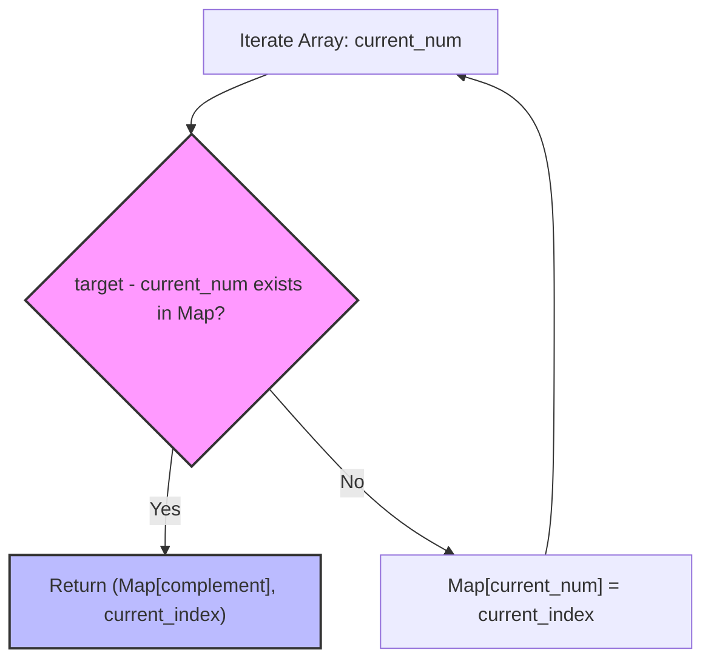

# Two Sum - Senior Engineer Interview Prep Guide

This guide is structured for a Senior Software Engineer interview, covering multiple approaches, complexity trade-offs, theoretical applications, and real-world systemic parallels.

---

## 1. Algorithmic Approaches & Comparisons

When discussing "Two Sum" in an interview, you should drive the conversation from the most naive approach to the most optimal, discussing trade-offs at each step.

### Approach 1: Brute Force (The Naive Way)
Check every possible pair iteratively.
- **Time Complexity:** $O(n^2)$ - We iterate through the rest of the array for each element.
- **Space Complexity:** $O(1)$ - No additional memory is used.
- **When to use:** Only when memory is extremely constrained ($O(1)$ space required), the dataset is tiny, or we cannot use associative arrays (hash tables).

### Approach 2: Two-Pass Hash Map
Trade space for time by caching values. We iterate once to build a hash map mapping each value to its index, then iterate again to check if `(target - nums[i])` exists in the map.
- **Time Complexity:** $O(n)$ - Traversing the array twice. Hash map lookups take $O(1)$ on average.
- **Space Complexity:** $O(n)$ - Storing up to $n$ elements in the hash map.
- **When to use:** Good intermediate step to explain your thought process. Helpful if the dataset is static and multiple "Two Sum" queries will be run against the same array.

### Approach 3: One-Pass Hash Map (Optimal)
Optimize the two-pass approach by building the hash map *while* checking for the complement.
- **Time Complexity:** $O(n)$ - We traverse the list exactly once.
- **Space Complexity:** $O(n)$ - We store at most $n$ elements.
- **When to use:** This is the strictly optimal approach for the standard "Two Sum" problem when space is not severely constrained.

### Trade-off Comparison Table

| Approach | Time Complexity | Space Complexity | Best For |
| :--- | :--- | :--- | :--- |
| **Brute Force** | $O(n^2)$ | $O(1)$ | Tiny arrays, strict memory limits ($O(1)$). |
| **One-Pass Hash Map** | $O(n)$ | $O(n)$ | Unsorted arrays where execution speed is the primary focus. |
| **Two Pointers (Pre-sorted)**| $O(n)$ | $O(1)$ | Arrays that are *already sorted* (memory-restricted environments). |

---

## 2. Visualization (One-Pass Hash Map)

Instead of searching the rest of the array with a slow nested loop, we maintain a history of visited items in a fast map.



---

## 3. Implementations (Pseudocode)

Instead of providing exact language bindings, here is the pseudocode so you can implement the solution constraints in any language of preference.

### Approach 3: One-Pass Hash Map (Optimal) Pseudocode
```text
function twoSum(nums, target):
    // Initialize an empty hash map (dictionary)
    // Key will be the 'number', Value will be its 'index'
    seen = empty HashMap
    
    for each index 'i' and value 'num' in nums:
        complement = target - num
        
        // Check if we've seen the complement before
        if seen contains 'complement':
            return [seen[complement], i]
        
        // Otherwise, store the current number and index
        seen[num] = i
        
    return [] // Should not reach here if exactly one valid answer exists
```

---

## 4. Conceptual Patterns & Type of Problems It Solves

The `Two Sum` problem introduces a foundational pattern: **Trading Space for Time via Caching/Hashing**.

1. **State Tracking (The "Seen" Pattern):** By storing context of what we have iterated over, we don't need to re-evaluate history. This solves "Complement Search" problems.
2. **Frequency Counting:** Extensions of this logic (like finding pairs that sum to $K$ and counting them) rely on hash maps storing `value -> frequency`.
3. **Difference / Target Finding:** Any problem asking to find pairs/triplets (`3Sum`, `4Sum`) or contiguous subarrays summing to a target (`Subarray Sum Equals K`) utilizes this fundamental Hash Map caching mechanism.

---

## 5. Real-World Equivalents & System Design Parallels

1. **Database Indexing & Caching (Redis/Memcached)**
   - **Analogy:** Doing Brute Force is like running a full table scan in a relational database for a join. Using a Hash Map is like reading from an index or an in-memory key-value cache (like Redis).
2. **Reconciliation Systems (Fintech / E-Commerce)**
   - **Analogy:** Imagine having a ledger of credits and debits, and you need to match a refund of `$50` to an original charge of `$50`.
   - **Real world:** We loop over all transactions, store them in a fast Hash Map mapped by amount and timestamp, and easily look up corresponding complement transactions to reconcile accounts.
3. **Cryptographic Nonces and Deduplication**
   - **Real world:** To prevent replay attacks, a server might store nonces (numbers used once) recently seen in a hash set. For every new request, the server checks if `nonce` is in the set ($O(1)$ lookup). If yes, reject. If no, add it to the set.

---

## 6. The "Senior" Follow-up Questions

For a senior role, the code is table stakes. A senior engineer shines by discussing system-level constraints. If asked to scale this:
- **What if the array is 1 Terabyte and doesn't fit in memory?** 
  - *Answer:* External sorting and chunking, splitting data across a distributed cluster (MapReduce schema), or writing to partitioned disk-backed Hash Tables (like RocksDB).
- **What if there are millions of `target` queries on the same static array?** 
  - *Answer:* Pre-compute into a Hash Map once ($O(n)$ initially), making subsequent queries strictly $O(1)$.
