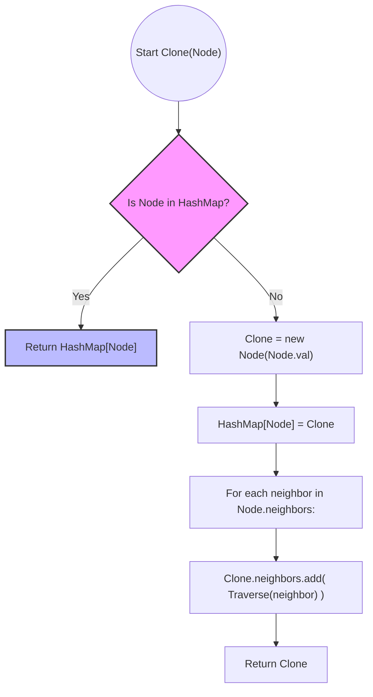

# Clone Graph - Senior Engineer Interview Prep Guide

This guide covers DFS and BFS graph traversal strategies for deep cloning, analyzing complexities and mapping the concept to real-world object marshaling.

---

## 1. Algorithmic Approaches & Comparisons

Cloning a graph means creating a completely new set of node objects that mirror the structure of an existing graph, without holding any references to the original node memory addresses.

### Approach 1: Depth-First Search (DFS) with Hash Map
We start at the given node, create a clone, and store the mapping `Original Node -> Cloned Node` in a Hash Map. We then recursively clone all neighbors. If we encounter a node already in our Hash Map, we just return the existing cloned reference to prevent infinite cycles.
- **Time Complexity:** $O(V + E)$ - Where $V$ is number of vertices (nodes) and $E$ is number of edges. We visit each node and edge exactly once.
- **Space Complexity:** $O(V)$ - Space required for the Hash Map to store all $V$ nodes, plus the call stack depth, which can be up to $O(V)$ in a worst-case linear graph.

### Approach 2: Breadth-First Search (BFS) with Hash Map
Similar to DFS, but we use a queue to iteratively process the graph level-by-level instead of the call stack.
- **Time Complexity:** $O(V + E)$
- **Space Complexity:** $O(V)$ - The Hash Map stores $V$ nodes, and the Queue can hold up to $V$ nodes in the worst case (e.g., a star graph).

### Trade-off Comparison Table

| Approach | Time Complexity | Space Complexity | Notes |
| :--- | :--- | :--- | :--- |
| **DFS (Recursive)** | $O(V + E)$ | $O(V)$ | Elegant and less code. Susceptible to StackOverflow for extremely deep trees/graphs. |
| **BFS (Iterative)** | $O(V + E)$ | $O(V)$ | Heap-allocated queue avoids stack depth limits. Standard industry pattern for massive graphs. |

---

## 2. Visualization (DFS with Hash Map)

The critical architectural maneuver for graph cloning is protecting against infinite cyclic loops. We resolve this by caching clones immediately before resolving their children.



---

## 3. Implementations (Pseudocode)

### Deep Clone Using DFS Graph Traversal
```text
function cloneGraph(node):
    if node is NULL: 
        return NULL
        
    // Hash map to track standard Visited state AND hold the new references
    // Map Format: { OriginalNodeReference : ClonedNodeReference }
    visited_map = empty HashMap
    
    // Define the recursive DFS helper
    function dfs(current_node):
        // If we already cloned this node, return the clone to prevent cycles
        if visited_map contains current_node:
            return visited_map[current_node]
            
        // 1. Create the independent clone
        clone = new Node(current_node.val)
        
        // 2. Immediately store it in the map before iterating neighbors
        //    (This stops infinite loops if a neighbor points right back to us)
        visited_map[current_node] = clone
        
        // 3. Recursively clone all neighbors and add to the clone's list
        for neighbor in current_node.neighbors:
            cloned_neighbor = dfs(neighbor)
            clone.neighbors.append(cloned_neighbor)
            
        return clone

    // Kick off DFS
    return dfs(node)
```

---

## 4. Conceptual Patterns & Type of Problems It Solves

- **Graph Traversal under Cycles:** Handling graphs requires avoiding infinite loops. The core pattern here is using a `Visited` set. In cloning, the `Visited` set is upgraded to a `Hash Map` that maps original state to new state.
- **Object Serialization / Deep Copy:** Any language construct that performs deep copies on objects containing cyclic object references (e.g., ORM models, JSON with circular refs) inherently uses this algorithm.

---

## 5. Real-World Equivalents & System Design Parallels

1. **Garbage Collection (Mark and Sweep)**
   - **Real world:** GC engines in JVM or V8 traverse object reference graphs starting from root objects. They use a visited state mapping to identify what is reachable and what can be deleted, handling circular references identically to this problem.
2. **Distributed System State Snapshots**
   - **Real world:** Taking a cold-storage backup of state machines or distributed dependency graphs (like a Terraform state file or an Airflow DAG) requires traversing the active memory graph and creating a disconnected "clone" written to disk.
3. **ORM (Object-Relational Mapping) Deep Saving**
   - **Real world:** When you call `save()` on a top-level parent entity in Django or Hibernate, it builds an execution graph to save the parent, and then iteratively saves all modified nested child entities, ensuring cyclic relationships write foreign-keys correctly.
