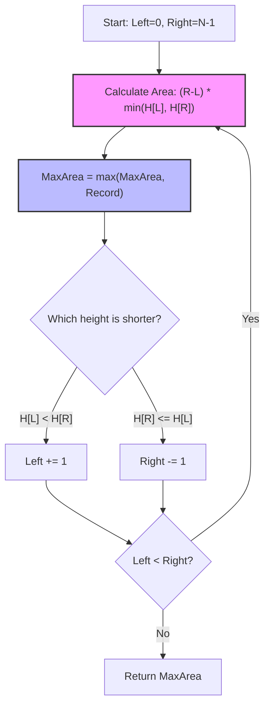

# Container With Most Water - Senior Engineer Interview Prep Guide

This guide breaks down maximizing area using the Two Pointer optimization technique (a spatial form of Greedy optimization), contrasting it against quadratic brute force iterations.

---

## 1. Algorithmic Approaches & Comparisons

Water volume in this 2D plane is defined mathematically by a simple rectangle area formula:
**Area = Width × Height**
- **Width:** The distance between the two lines (`right_index - left_index`).
- **Height:** The limiting factor is the *shorter* line of the two (`min(height[left], height[right])`). Water spills over the shorter bound.

### Approach 1: Brute Force
Check every possible pair of lines and calculate the volume.
- **Time Complexity:** $O(n^2)$ - We evaluate $n(n-1)/2$ combinations.
- **Space Complexity:** $O(1)$
- **When to use:** Never practically, but it establishes the mathematical baseline.

### Approach 2: Two Pointers (Greedy Optimization)
Place one pointer at `left = 0` and another at `right = n - 1`. This gives us the **maximum possible width**. Now, how do we maximize height? We calculate the area. Then, to potentially find a *larger* area, we must compensate for a shrinking width. The only way to get a larger area with a smaller width is to find a *taller* vertical line. Therefore, we **move the pointer pointing to the shorter vertical line inward**. We repeat this greedily until `left` and `right` collide.
- **Time Complexity:** $O(n)$ - We traverse the array exactly once from boundaries inward.
- **Space Complexity:** $O(1)$ - Constant space usage.
- **When to use:** This is the optimal, standard expected solution.

### Trade-off Comparison Table

| Approach | Time Complexity | Space Complexity | Notes |
| :--- | :--- | :--- | :--- |
| **Brute Force** | $O(n^2)$ | $O(1)$ | Fails rapidly on constraints up to $10^5$. |
| **Two Pointers** | $O(n)$ | $O(1)$ | Elegant, optimally greedy. |

---

## 2. Visualization (Two Pointers)



---

## 3. Implementations (Pseudocode)

### Greedy Two Pointer Pseudocode
```text
function maxArea(height):
    left = 0
    right = length(height) - 1
    max_area = 0
    
    while left < right:
        // Calculate dimensions
        current_width = right - left
        current_height = min(height[left], height[right])
        current_area = current_width * current_height
        
        // Update max observed
        max_area = max(max_area, current_area)
        
        // GREEDY LOGIC: We want taller boundaries.
        // Therefore, discard the shorter boundary because it guarantees 
        // a worse outcome as width inevitably shrinks on the next loop.
        if height[left] < height[right]:
            left = left + 1
        else:
            right = right - 1
            
    return max_area
```

---

## 4. Conceptual Patterns & Type of Problems It Solves

- **Two Pointer Squeeze:** A prominent pattern used when working with contiguous sorted data, OR data where you are maximizing boundaries. 
- **Greedy Boundary Elimination:** Proving mathematically that `moving the taller pointer` is useless (since width shrinks, and height is STILL bounded by the existing shorter line) allows us to eliminate $O(n^2)$ search spaces instantly.

---

## 5. Real-World Equivalents & System Design Parallels

1. **Min/Max Yield Boundary Seeking**
   - **Real World:** In computational physics or fluid dynamic simulations (e.g., oil rig storage volumes or dam flood capacities), locating maximum potential yields between two topographical points uses boundary squeeze heuristics to eliminate calculating every single square foot physically.
2. **Market Bidding Arbitrage**
   - **Real World:** In financial tech matching engines, isolating the "maximum spread" within an order book timeline given constraints (buy low on Date X, sell high on Date Y, compensating for holding decay) models against two-pointer maximization.
3. **Database Range Query Optimization**
   - **Real World:** SQL Query optimizers evaluating constraints like "find the largest date gap where logs exist" naturally map to boundary crawling algorithms that optimize over index lengths rather than doing Cartesian cross-joins.

---

## 6. The "Senior" Follow-up Questions

- **Why is moving the smaller pointer mathematically guaranteed to not miss the maximum volume?**
  - *Answer:* Let the pointers be $L$ and $R$, and assume $H[L] < H[R]$. The area is $H[L] \times (R - L)$. If we instead moved $R$ left, the distance $(R - L)$ strictly decreases, and the limiting height remains at *most* $H[L]$ (it cannot increase because $H[L]$ bounds it). Thus, moving $R$ mathematically strictly yields a smaller volume. The only theoretical hope for a larger area is eliminating $H[L]$.
