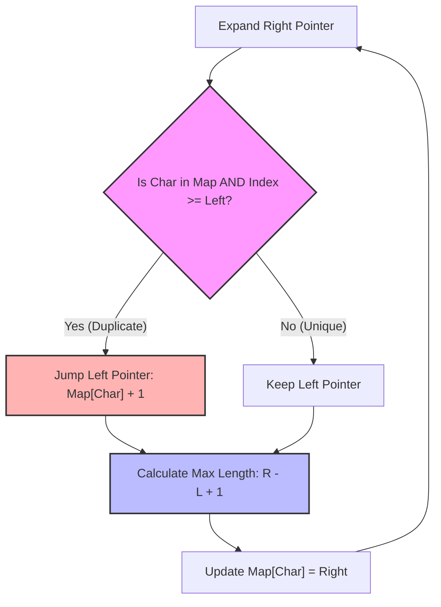

# Longest Substring Without Repeating Characters - Senior Engineer Interview Prep Guide

This guide covers approaches from naive brute force to the optimal sliding window technique, analyzing complexities and discussing real-world systems parallels for a Senior Software Engineer interview.

---

## 1. Algorithmic Approaches & Comparisons

### Approach 2: Sliding Window with Hash Set
Use a left and right pointer to represent a window. Expand the right pointer. If a duplicate is found, shrink the window by moving the left pointer until the duplicate is removed from the set.
- **Time Complexity:** $O(n)$ - in the worst case, each character will be visited twice (once by `right` pointer and once by `left` pointer). 
- **Space Complexity:** $O(\min(n, m))$ - Hash set to store characters in the current window.

### Approach 3: Optimized Sliding Window (Hash Map / Array)
Instead of shrinking the left pointer step-by-step, we jump the left pointer directly *after* the previous occurrence of the duplicated character.
- **Time Complexity:** $O(n)$ - Traversing the string exactly once. Left pointer jumps, so we do at most $n$ operations.
- **Space Complexity:** $O(m)$ for a Hash Map, or strictly $O(1)$ (e.g., size 128 integer array for ASCII map).

---

## 2. Visualization (Optimized Jumping Hash Map)

The sliding window expands right, and mathematical jumps occur on the left boundary whenever uniqueness is compromised.



---

## 3. Implementations (Pseudocode)

### Approach 3: Optimized Sliding Window (Hash Map Jump)
```text
function lengthOfLongestSubstring(s):
    // Map to keep track of a character and its last seen index
    char_index_map = empty HashMap
    left = 0
    max_length = 0
    
    for right from 0 to length(s) - 1:
        current_char = s[right]
        
        // If we have seen this char before AND its last index is inside our current window boundaries
        if char_index_map contains current_char:
            if char_index_map[current_char] >= left:
                // Jump the left pointer precisely one step past the last occurrence
                left = char_index_map[current_char] + 1
        
        // Update the latest index for this character
        char_index_map[current_char] = right
        
        // Compare with current max
        window_size = right - left + 1
        max_length = max(max_length, window_size)
    
    return max_length
```

---

## 4. Conceptual Patterns & Type of Problems It Solves

This problem introduces the **Sliding Window** pattern.
1. **Dynamic Sliding Window:** Expand right bound to explore, contract left bound upon constraint breakage.
2. **Frequency/Last Seen State Tracking (Caching):** Mapping `Key -> Latest Index` prevents scanning backwards.

---

## 5. Real-World Equivalents & System Design Parallels

1. **Network Packet Stream Processing & TCP Sliding Windows**
   - **Real World:** TCP utilizes sliding windows to control data flow. Receivers process incoming streams in "windows". 
2. **Deduplication in Log Rotation / APM Tools**
   - **Real World:** Streaming log analysis platforms utilize sliding time-windows to squash identical anomalous stack traces into a single record.
3. **Rate Limiting & Token Buckets**
   - **Real world:** Determining if a new request is valid involves shifting a "left pointer" representing the timestamp `N` seconds ago and validating uniqueness/frequency counts inside the window.

---

## 6. The "Senior" Follow-up Questions

- **What if the character set is massive (e.g., entire Unicode dataset)?**
  - *Answer:* Array allocation of index mapping becomes too large. We must fall back to a Hash Map with dynamic resizing, trading $O(1)$ strict array time for spatial safety.
- **How would this behave on an infinite data stream (e.g., Kafka)?**
  - *Answer:* We cannot load the stream. We must read character by character. As the window moves, we drop references from the hash map whose index is strictly less than the `left` pointer to prevent infinite memory scale-up.
