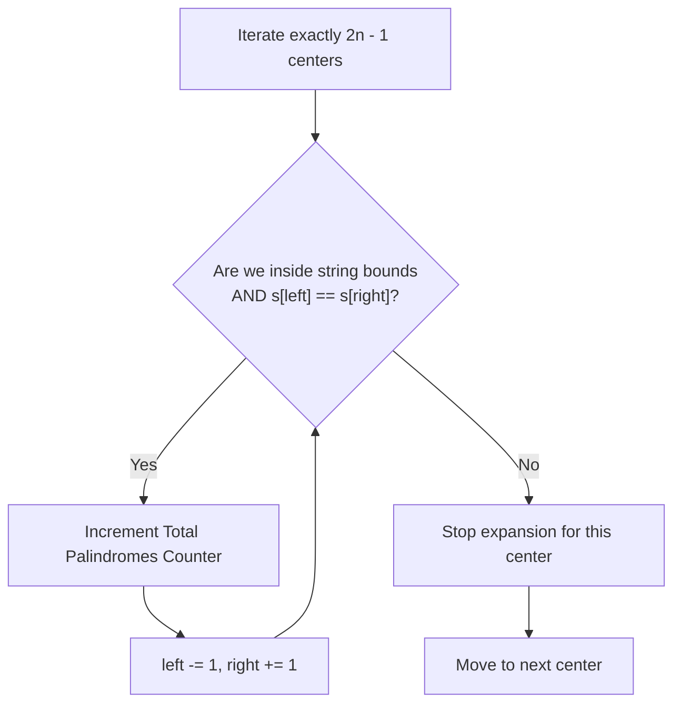

# Palindromic Substrings - Senior Engineer Interview Prep Guide

This guide extends the core palindromic logic used in "Longest Palindromic Substring", shifting the focus from maximizing *length* to maximizing *frequency count* using Expand Around Center.

---

## 1. Algorithmic Approaches & Comparisons

### Approach 1: Brute Force
Enumerate all possible substrings and implement an independent helper function to check if each is a palindrome.
- **Time Complexity:** $O(n^3)$ - $O(n^2)$ to define all substrings, and $O(n)$ to verify each.
- **Space Complexity:** $O(1)$
- **When to use:** Theoretical basis.

### Approach 2: Expand Around Center (Optimal)
Instead of searching from the edges inward, we select each index (and the space between indices) as a center, expanding outward. Every time we encounter a match, it represents a valid palindromic substring, and we increment a global counter. 
- **Time Complexity:** $O(n^2)$ - We visit $2n - 1$ centers, and for each center, we expand up to $n/2$ times.
- **Space Complexity:** $O(1)$ - Constant space usage. No memory matrices are tracked.
- **When to use:** This is the standard, memory-optimal answer expected in interviews.

### Approach 3: Dynamic Programming (DP)
Create an $n \times n$ boolean table where `dp[i][j]` is true if the substring from `i` to `j` is a palindrome. If `s[i] == s[j]` and `dp[i+1][j-1]` is true, then `dp[i][j]` is true. We count true values.
- **Time Complexity:** $O(n^2)$
- **Space Complexity:** $O(n^2)$
- **When to use:** Good for teaching overlapping subproblems, but wastes strict memory compared to expanding around centers.

### Trade-off Comparison Table

| Approach | Time Complexity | Space Complexity | Notes |
| :--- | :--- | :--- | :--- |
| **Brute Force** | $O(n^3)$ | $O(1)$ | Impractical for string size $> 500$. |
| **DP Matrix** | $O(n^2)$ | $O(n^2)$ | Wastes space. |
| **Expand Around Center** | $O(n^2)$ | $O(1)$ | Highly optimal $O(1)$ space. |

---

## 2. Visualization (Expand Around Center)



---

## 3. Implementations (Pseudocode)

### Expand Around Center Pseudocode
```text
function countSubstrings(s):
    if s is null or length of s == 0:
        return 0
        
    total_palindromes = 0
    length_s = length(s)
    
    // Helper function to expand from a specific left and right starting point
    function countFromCenter(left, right):
        count = 0
        // Expand outwards as long as chars match
        while left >= 0 AND right < length_s AND s[left] == s[right]:
            count = count + 1
            left = left - 1
            right = right + 1
        return count

    // Iterate through all possible centers
    for i from 0 to length_s - 1:
        // 1. Odd length palindromes (single char center) -> e.g., "a" in "aba"
        total_palindromes += countFromCenter(i, i)
        
        // 2. Even length palindromes (boundary between chars) -> e.g., "bb" in "abba"
        total_palindromes += countFromCenter(i, i + 1)
        
    return total_palindromes
```

---

## 4. Conceptual Patterns & Type of Problems It Solves

- **Axis Expansion vs Boundary Contraction:** Instead of asking "Is this whole boundary valid?", we ask "How far can this seed grow?". It shifts problem complexity from $O(n^3)$ to $O(n^2)$ by realizing palindromes grow multiplicatively from within.
- **Parity Tracking:** Dealing with both explicit character nodes (odd length) and the mathematical empty space between characters (even length).

---

## 5. System Design Parallels

1. **State Machine Seed Algorithms**
   - **Analogy:** In generative programming or cellular automata, patterns bloom from a central seed point rather than being analyzed top-down.
2. **Convolutional Neural Networks (CNN)**
   - **Real world:** Extracting features from visual data mirrors this expansion. A localized feature "center" (like detecting an edge) expands outward to verify spatial symmetries on images.
