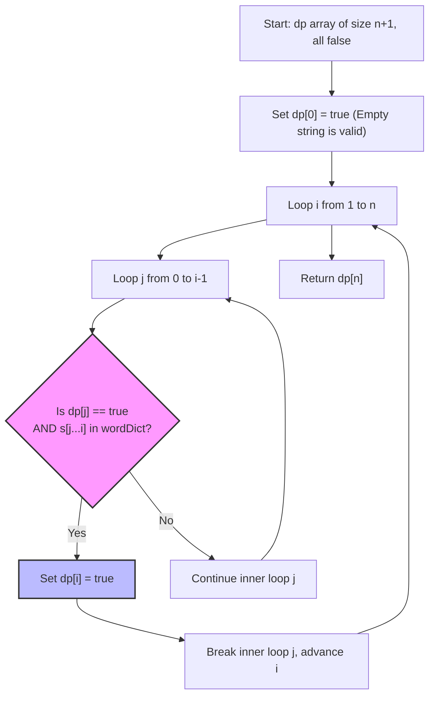

# Word Break - Senior Engineer Interview Prep Guide

This guide breaks down string segmentation using Breadth-First Search (BFS) and Dynamic Programming (DP), exploring overlapping subproblems and how state caching transforms exponential complexity into quadratic.

---

## 1. Algorithmic Approaches & Comparisons

The problem asks for a boolean result: can we segment the string? This requires testing combinations of prefixes and suffixes.

### Approach 1: Brute Force Recursion
Recursively check every possible prefix of the string. If the prefix exists in the dictionary, recursively call the function on the remaining suffix. 
- **Time Complexity:** $O(2^n)$ - In the worst case (e.g., `s = "aaaaa"`, `wordDict = ["a", "aa", ...]`), we branch at every single character character, creating a massive recursion tree.
- **Space Complexity:** $O(n)$ - Call stack depth.
- **When to use:** Purely theoretical. It will TLE (Time Limit Exceeded) immediately.

### Approach 2: Top-Down Recursion with Memoization
We optimize the brute force tree by caching suffixes we've already evaluated. If we know that suffix `s[i:]` cannot be broken down, we store `memo[i] = false` and never evaluate it again.
- **Time Complexity:** $O(n^3)$ - The recursion tree depth is $n$. At each step, we iterate up to $n$ to create substrings, and string hashing/comparison takes up to $O(n)$ in most languages.
- **Space Complexity:** $O(n)$ - Recursive call stack and memoization dictionary.
- **When to use:** Good intermediate step in an interview if you default to recursive thinking.

### Approach 3: Bottom-Up Dynamic Programming (Optimal)
We iteratively build a boolean array `dp` of size $n+1$, where `dp[i]` represents if the substring `s[0:i]` can be successfully segmented. 
For every end index `i`, we check every start index `j` (where $j < i$). If `dp[j]` is true (meaning the first half works) AND the substring `s[j:i]` is in the dictionary (meaning the second half works), then `dp[i]` becomes true!
- **Time Complexity:** $O(n^3)$ - Nested loops over $n$ give $O(n^2)$, plus $O(n)$ to slice and hash the substring `s[j:i]`. Note: If the dictionary max word length is small ($L$), we can optimize the inner loop to bound at $L$, making time $O(n^2 \cdot L)$ or even $O(n \cdot L^2)$.
- **Space Complexity:** $O(n)$ - Required for the `dp` array.
- **When to use:** This is the standard expected interview solution. It's clean, iterative, and avoids recursion overhead.

### Trade-off Comparison Table

| Approach | Time Complexity | Space Complexity | Notes |
| :--- | :--- | :--- | :--- |
| **Brute Force** | $O(2^n)$ | $O(n)$ | Exponential explosion on overlapping words. |
| **Top-Down Memoization**| $O(n^3)$ | $O(n)$ | Solves the problem but recursive stack carries overhead. |
| **Bottom-Up DP** | $O(n^3)$ | $O(n)$ | Clean, optimal, industry-standard approach. |

---

## 2. Visualization (Bottom-Up Dynamic Programming)

The DP array propagates "reachability". If `dp[j]` is reachable, and the text from `j` to `i` is a valid word, then `dp[i]` becomes reachable.



---

## 3. Implementations (Pseudocode)

### DP Bottom-Up Pseudocode
```text
function wordBreak(s, wordDict):
    // Converting dictionary to a Hash Set makes lookups O(1) instead of O(K)
    word_set = create HashSet from wordDict
    
    n = length of s
    
    // dp[i] represents whether the substring s[0...i-1] can be segmented
    dp = boolean array of size n + 1, all initialized to false
    
    // Base case: an empty string can always be segmented
    dp[0] = true
    
    // 'i' represents the end index of the current substring we are checking
    for i from 1 to n:
        
        // 'j' represents the split point
        for j from 0 to i - 1:
            
            // Extract the substring specifically from index j up to i
            current_word = substring of s from index j to i
            
            // If the first part (up to j) is valid AND the second part is in the dict
            if dp[j] is true AND word_set contains current_word:
                dp[i] = true
                break // We found a valid split ending at 'i', no need to check other 'j's
                
    // The final answer is whether the entire string (length n) is valid
    return dp[n]
```

---

## 4. Conceptual Patterns & Type of Problems It Solves

- **Overlapping Subproblems (State Caching):** Problems like parsing, natural language tokenization, or pathfinding on grids heavily overlap. Solving small pieces (`dp[j]`) and using them to construct the final piece (`dp[n]`) introduces the core DP technique.
- **Prefix/Suffix Splitting:** A common pattern in string parsing. If you want to know if a string is valid, split it. If the prefix is valid, validate the suffix.

---

## 5. Real-World Equivalents & System Design Parallels

1. **Natural Language Processing (NLP) / Tokenization**
   - **Real World:** Languages like Chinese and Japanese do not use spaces between words. Search engines (like Elasticsearch) and LLMs must run algorithmic tokenization to "word break" an incoming sentence into dictionary-recognized terms.
2. **URL Routing and Path Resolution**
   - **Real world:** When a web framework parses a dynamic URL like `/users/auth/login`, it checks a routing dictionary. It iteratively checks if `/users` is a valid mount point, and then recursively breaks the rest of the string into valid configured endpoint tokens.
3. **Spell Checkers & Password Validators**
   - **Real world:** Cracking algorithms often check if a password like `adminpassword123` is a concatenation of dictionary words. This exact DP array is used to flag passwords composed entirely of known weak dictionary strings.

---

## 6. The "Senior" Follow-up Questions

- **What if the dictionary has millions of words, and we run memory limits using a Hash Set?**
  - *Answer:* We should transition from a Hash Set to a **Trie (Prefix Tree)**. A Trie compresses identical string prefixes (e.g., "apple", "app", "application") into a single path, drastically reducing memory overhead at the cost of traversing the tree during the inner loop instead of a strict $O(1)$ hash lookup.
- **How would you return *all possible* sentences, rather than just `true/false`?**
  - *Answer:* This pivots into **Word Break II**. We would use Top-Down DFS with Memoization. Instead of storing a boolean in our cache, we map `index -> List of valid suffix strings` to reconstruct paths backwards.
